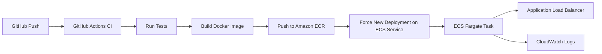

# AWS CI/CD Blueprint

Production-oriented CI/CD blueprint using GitHub Actions + AWS ECS Fargate.

## What This Project Delivers

- Containerized Python web app with health endpoint.
- Infrastructure as Code with Terraform:
  - ECR repository
  - ECS cluster and service (Fargate)
  - Application Load Balancer
  - IAM roles for ECS tasks
  - CloudWatch logs
- GitHub Actions pipeline:
  - Test step (pytest)
  - Security gates (Bandit + pip-audit)
  - Docker build and push to ECR
  - Automated ECS rollout

## Architecture



## Repository Layout

- `app/` application source and tests
- `infra/terraform/` AWS infrastructure
- `.github/workflows/ci-cd.yml` CI/CD workflow
- `docs/architecture.md` deployment and IAM notes

## Prerequisites

- AWS account
- Terraform >= 1.6
- GitHub repository with Actions enabled
- Docker installed locally (for manual tests)

## 1) Deploy Infrastructure

```bash
cd infra/terraform
cp terraform.tfvars.example terraform.tfvars
terraform init
terraform plan
terraform apply
```

Set values in `terraform.tfvars` for:

- `vpc_id`
- `public_subnet_ids`
- `private_subnet_ids`

## 2) Configure GitHub Variables and Secret

Repository Variables:

- `AWS_REGION` (example `us-east-1`)
- `AWS_ECR_REPOSITORY` (example `aws-cicd-blueprint`)
- `AWS_ECS_CLUSTER` (example `aws-cicd-blueprint-cluster`)
- `AWS_ECS_SERVICE` (example `aws-cicd-blueprint-service`)

Repository Secret:

- `AWS_ROLE_TO_ASSUME` (OIDC role ARN for GitHub Actions)

## 3) Trigger Deployment

Push to `main` or `master`.

Pipeline flow:

1. Run tests
2. Build image
3. Push image to ECR (`sha` + `latest`)
4. Force ECS service rollout

## Local Run

```bash
docker build -t aws-cicd-blueprint .
docker run --rm -p 8080:8080 aws-cicd-blueprint
```

Health check:

```bash
curl http://localhost:8080/health
```

## Next Improvements

- Add blue/green deployment with CodeDeploy
- Add security scans (Trivy + Bandit)
- Add policy-as-code checks (OPA/Conftest)
- Add staged environments with manual approval gates
